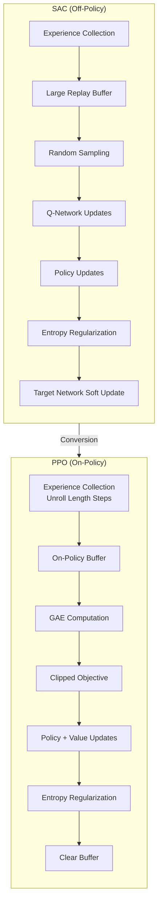

# SAC to PPO Conversion Report

## Overview

This report documents the conversion of the Snake Approach training script from Soft Actor-Critic (SAC) to Proximal Policy Optimization (PPO).

---

## Algorithm Comparison



---

## Files Created

| File | Description |
|------|-------------|
| [snake_approach_ppo_conf.py](file:///home/turn_cloak/RL_attempt1/dismech-rl/confs/snake_approach_ppo_conf.py) | PPO configuration importing `common_ppo_training_conf.py` |
| [train_snake_approach_ppo.sh](file:///home/turn_cloak/RL_attempt1/dismech-rl/scripts/train_snake_approach_ppo.sh) | Training shell script with PPO parameters |

---

## Parameter Changes

| Parameter | SAC Value | PPO Value | Rationale |
|-----------|-----------|-----------|-----------|
| `UTD_RATIO` | 8 | 4 | PPO needs fewer updates per iteration |
| `NUM_PARALLEL_ENVS` | 200 | 256 | Standard PPO setting |
| `REPLAY_BUFFER_LENGTH` | 4000 | *Removed* | On-policy; buffer cleared each iteration |
| `INITIAL_COLLECT_STEPS` | 1000 | *Removed* | Not needed for on-policy learning |
| `UNROLL_LENGTH` | *N/A* | 4 | Trajectory steps before training |
| `ENTROPY_REG` | *N/A* | 0.05 | Exploration via entropy bonus |

---

## Issues Encountered

### Issue 1: Immutable Configuration Warnings

**Description:** During execution, warnings appeared indicating certain config values were already set:
```
W0118 12:10:05.537265 ... The config 'create_environment.num_parallel_environments' 
has been configured to an immutable value of 256. The new value 256 will be ignored
```

**Solution:** No fix required. These warnings occur because `common_ppo_training_conf.py` sets default values, and the shell script passes the same values. The values match, so behavior is correct. To eliminate warnings, redundant `--conf_param` overrides could be removed if desired.

---

### Issue 2: Deprecated PyTorch API Warnings

**Description:** Deprecation warnings for `torch.cuda.amp.autocast`:
```
FutureWarning: `torch.cuda.amp.autocast(args...)` is deprecated. 
Please use `torch.amp.autocast('cuda', args...)` instead.
```

**Solution:** No fix required. This is a warning from the ALF framework code, not our script. Functionality is unaffected.

---

## Verification Results

**Test Command:**
```bash
source .venv/bin/activate
NUM_ITERATIONS=10 bash scripts/train_snake_approach_ppo.sh
```

**Results:**
- ✅ Script executed without errors
- ✅ 256 parallel environments created successfully
- ✅ Training ran for 10 iterations
- ✅ 10 checkpoints saved
- ✅ Exit code: 0

**Training Output (excerpt):**
```
Starting Snake Approach PPO training. Monitor with:
  tensorboard --logdir .../snake_approach_ppo_20260118_120955 --port 6006

observation_spec=ApproachObservation(state_pos=(30,), state_vel=(30,), ...)
action_spec=BoundedTensorSpec(shape=(10,), dtype=torch.float32, ...)

[pid: 426986] snake_approach_ppo_conf.py: 1 time=3.858 throughput=1327.07
[pid: 426986] snake_approach_ppo_conf.py: 2 time=2.801 throughput=1828.23
...
Checkpoint 'ckpt-10' is saved successfully.

Training stopped. Results saved to: .../snake_approach_ppo_20260118_120955
Time elapsed: 0h 1m 14s
```

---

## Final Summary

| Aspect | Status |
|--------|--------|
| Script Creation | ✅ Complete |
| Configuration | ✅ Complete |
| Syntax Errors | ✅ None |
| Runtime Errors | ✅ None |
| Training Execution | ✅ Verified |

**The PPO conversion is fully operational.**
